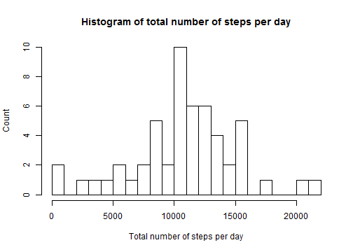
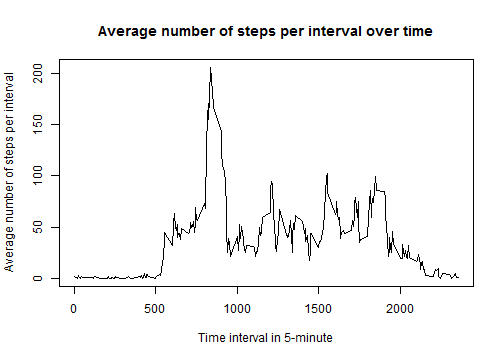
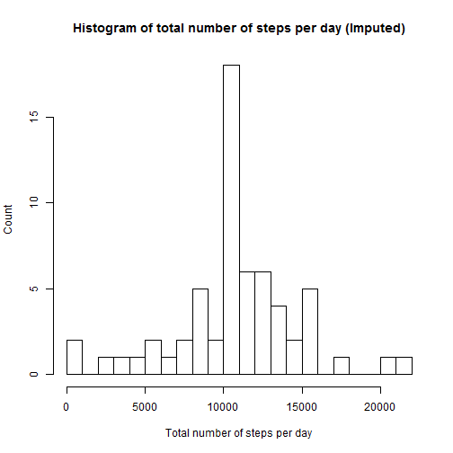

## Loading and preprocessing the data


```r
data <- read.csv(file="activity.csv", header=TRUE, sep=",")

dim(data)
```

```
## [1] 17568     3
```

```r
head(data)
str(data)
```

```
## 'data.frame':	17568 obs. of  3 variables:
##  $ steps   : int  NA NA NA NA NA NA NA NA NA NA ...
##  $ date    : Factor w/ 61 levels "2012-10-01","2012-10-02",..: 1 1 1 1 1 1 1 1 1 1 ...
##  $ interval: int  0 5 10 15 20 25 30 35 40 45 ...
```

## What is the mean total number of steps taken per day?

### First, compute each day's total value of steps

```r
library('plyr') # load plyr package

per_day_total <- ddply(data, .(date), summarize, sum=sum(steps)) 

head(per_day_total)
```

### Then, plot a histogram of the total steps per day

```r
hist(per_day_total$sum, nclass=30, main="Histogram of total number of steps per day", xlab="Total number of steps per day", ylab="Count")
```



### Finally, compute the mean and median of the above total steps

```r
summary(per_day_total$sum) 
```

```
##    Min. 1st Qu.  Median    Mean 3rd Qu.    Max.    NA's 
##      41    8841   10765   10766   13294   21194       8
```


## What is the average daily activity pattern?


```r
na_omit_data = na.omit(data)

per_interval_stat <- ddply(na_omit_data, .(interval), summarize, sum=sum(steps), means=mean(steps)) 

plot(per_interval_stat$interval, per_interval_stat$means, type="l", main="Average number of steps per interval over time", xlab="Time interval in 5-minute", ylab="Average number of steps per interval")
```




### Find the time interval that has the maximum average number of steps across days


```r
index = which.max(per_interval_stat$means)

per_interval_stat$interval[index]
```

```
## [1] 835
```


## Imputing missing values

### First find the number of rows with NA or missing values 

```r
num_rows_NA <- sum(is.na(data$steps))
```

There are 2304 rows with missing values or "NA" in the original data. 


### We will use the average number of steps across all of the rest of days with real data per every 5-minute interval to replace all of the "NA" for the corresponding interval. 


```r
imputed_data <- data

index_NA_rows <- which(is.na(data$steps), arr.ind=TRUE)

# try a for loop
for (index in index_NA_rows) {
    interval = imputed_data$interval[index]
    imputed_data$steps[index] = per_interval_stat$means[ per_interval_stat$interval == interval ]
}

# the below method only worked for the first 288 rows of data
#imputed_data$steps[index_NA_rows] = per_interval_stat$means[(imputed_data$interval[index_NA_rows] == per_interval_stat$interval)]

head(imputed_data)
tail(imputed_data)
```

### Plot a new histogram using the imputed data 


```r
imputed_per_day_total <- ddply(imputed_data, .(date), summarize, sum=sum(steps)) 

hist(imputed_per_day_total$sum, nclass=30, main="Histogram of total number of steps per day (Imputed)", xlab="Total number of steps per day", ylab="Count")
```




### Compute the mean and median of daily number of steps with imputed data 


```r
summary(imputed_per_day_total$sum) 
```

```
##    Min. 1st Qu.  Median    Mean 3rd Qu.    Max. 
##      41    9819   10766   10766   12811   21194
```

As shown by the new histogram plot and new summary statistics, by imputing the missing values with average number of steps per 5-minute interval, the new histogram has a significantly higher peak around 10766, which is the mean value of the daily number of steps.  


## Are there differences in activity patterns between weekdays and weekends?

### Then, we will create a new vector, which is a factor with two levels, "weekday" and "weekend". 


```r
day_status = weekdays(as.Date(data$date))
day_status[day_status != "Saturday" & day_status != "Sunday"] = "weekday"
day_status[day_status == "Saturday" | day_status == "Sunday"] = "weekend"
sum(day_status == "weekend")
```

```
## [1] 4608
```

```r
sum(day_status == "weekday")
```

```
## [1] 12960
```


### Then, we will add this vector as a new column to the imputed data.


```r
new_data = cbind(imputed_data, day_status)
head(new_data)
```

### Finally, we will create a multi-panel plot showing the per-5-minute interval average number of steps across all days, split into "weekend" view and "weekday" view. 


```r
weekday_data = new_data[new_data$day_status == "weekday", ]
weekend_data = new_data[new_data$day_status == "weekend", ]

weekday_interval_stat <- ddply(weekday_data, .(interval), summarize, sum=sum(steps), means=mean(steps)) 
weekend_interval_stat <- ddply(weekend_data, .(interval), summarize, sum=sum(steps), means=mean(steps)) 

par(mfrow=c(2,1), oma=c(1, 0, 0, 0))
plot(weekday_interval_stat$interval, weekday_interval_stat$means, type='l', main="weekday", xlab="", ylab="")
plot(weekend_interval_stat$interval, weekend_interval_stat$means, type='l', main="weekend", xlab="", ylab="")

mtext("Time Interval", side=1, outer=TRUE, cex=1.5)
mtext("Average number of steps over multiple days", side=2, outer=TRUE, line=-1, cex=1.5)
```


## Render Rmd file to HTML


```
## 
## 
## processing file: PA1_template.Rmd
```

```
## Error in parse_block(g[-1], g[1], params.src): duplicate label 'load-data'
```

```
## 
## Output created: PA1_template.html
```

